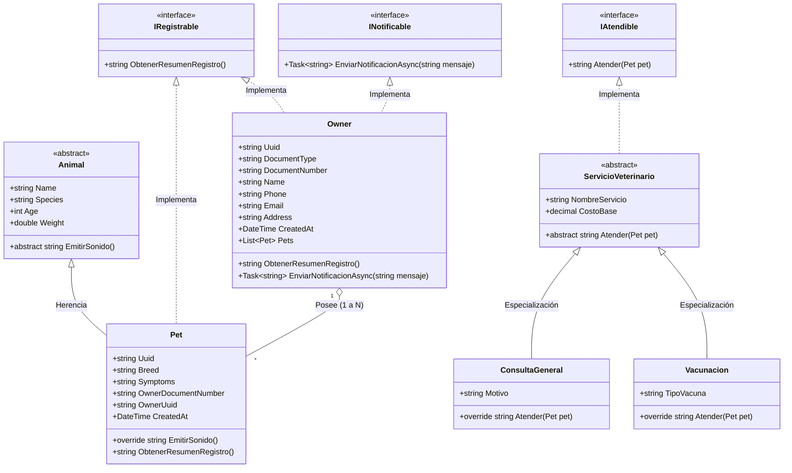

# Diagrama de Clases UML - LovelyPetShop Clínica Veterinaria

Este documento modela la estructura orientada a objetos de **LovelyPetShop**, reflejando las relaciones de herencia, polimorfismo, abstracción e implementación de interfaces de dominio de acuerdo con los requerimientos de la Historia de Usuario 3.

---

## 1. Diagrama de Clases UML (Mermaid)

---

## 2. Explicación de Conceptos POO Aplicados

### A. Herencia y Polimorfismo
* **Clase Base `Animal`**: Encapsula propiedades universales de cualquier animal (`Name`, `Species`, `Age`, `Weight`) y define el método abstracto `EmitirSonido()`.
* **Clase Derivada `Pet`**: Extiende a `Animal`, añadiendo atributos propios de mascotas domésticas de clínica (`Breed`, `OwnerDocumentNumber`, `Symptoms`) y sobrescribe `EmitirSonido()` para emitir sonidos específicos por especie (`"¡Guau guau!"`, `"¡Miau miau!"`, etc.).

### B. Abstracción
* **Clase Abstracta `ServicioVeterinario`**: Provee el contrato base y atributos compartidos (`NombreServicio`, `CostoBase`) forzando la implementación del método `Atender(Pet pet)` en subclases concretas como `ConsultaGeneral` y `Vacunacion`.

### C. Múltiples Interfaces de Dominio
* **`IRegistrable`**: Implementada tanto por `Owner` como por `Pet`, estandarizando la obtención de resúmenes de registro.
* **`INotificable`**: Implementada por `Owner` para el envío no bloqueante de avisos por mensajería o correo electrónico.
* **`IAtendible`**: Implementada por `ServicioVeterinario` para estandarizar la atención a pacientes.

### D. Encapsulación y Asociación 1 a N
* Un `Owner` mantiene una lista fuertemente tipada de mascotas asociadas (`List<Pet> Pets`), manteniendo la integridad de las relaciones y protegiendo el acceso a los datos.
