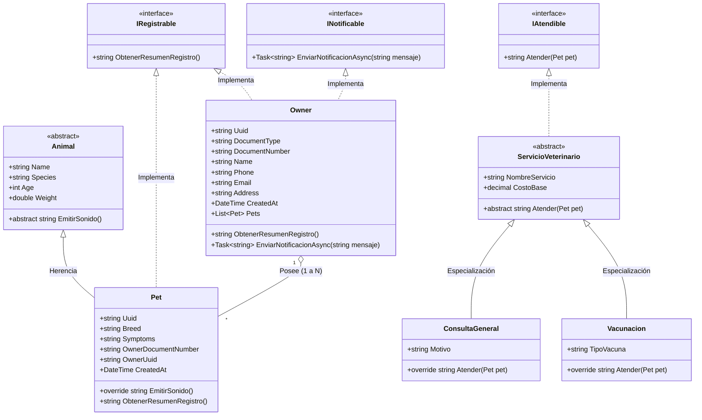

# LovelyPetShop - Sistema de Gestión Veterinaria

[](https://dotnet.microsoft.com/)
[](https://learn.microsoft.com/dotnet/csharp/)
[](https://xunit.net/)
[](LICENSE)
[](#arquitectura-del-sistema)

**LovelyPetShop** es un sistema integral de gestión para clínicas veterinarias desarrollado como aplicación de consola interactiva en **C# 14** y **.NET 10**. El proyecto implementa una arquitectura limpia por capas, persistencia de datos en archivos JSON asíncronos, consultas analíticas avanzadas con LINQ, concurrencia y paralelismo no bloqueante (`Task.WhenAll` / `Task.WhenAny`), modelado orientado a objetos con polimorfismo e interfaces de dominio, además de una completa suite de pruebas unitarias con **xUnit**.

---

## Tabla de Contenidos

- [Características Principales](#características-principales)
- [Arquitectura del Sistema](#arquitectura-del-sistema)
  - [Diagrama de Arquitectura por Capas](#diagrama-de-arquitectura-por-capas)
  - [Diagrama de Clases UML (POO & Dominio)](#diagrama-de-clases-uml-poo--dominio)
- [Estructura del Proyecto](#estructura-del-proyecto)
- [Modelo de Datos y Persistencia](#modelo-de-datos-y-persistencia)
- [Requisitos Previos](#requisitos-previos)
- [Instalación y Ejecución](#instalación-y-ejecución)
- [Guía del Menú Interactivo (CLI)](#guía-del-menú-interactivo-cli)
- [Pruebas Unitarias y Calidad de Código](#pruebas-unitarias-y-calidad-de-código)
- [Conceptos Técnicos Destacados](#conceptos-técnicos-destacados)
- [Licencia](#licencia)

---

## Características Principales

### 1. Gestión Integral de Propietarios (HU 1)
- **Registro validado**: Admite tipos de documentos colombianos (`CC`, `TI`, `CE`, `PASAPORTE`), nombres, teléfonos móviles (`3XX-XXX-XXXX`), correos electrónicos con formato estándar y direcciones físicas.
- **Búsqueda eficiente**: Localización inmediata de propietarios por documento de identidad o identificador único (UUID).
- **Paginación dinámica**: Visualización de listas tabulares paginadas de 5 en 5 con comandos de navegación interactiva (`[N]` siguiente, `[P]` anterior, `[Q]` salir).
- **Actualización y Eliminación**: Modificación controlada de información de contacto y baja lógica/física con validaciones de integridad referencial.

### 2. Gestión de Pacientes y Mascotas
- **Registro vinculado**: Asociación obligatoria y fuertemente tipada de cada mascota a su respectivo dueño.
- **Identificación única**: Asignación automática de UUID v4 a cada paciente registrado.
- **Historial y Síntomas**: Registro de especie, raza, edad, peso y cuadro sintomatológico actual.
- **Registro Rápido Combinado**: Creación atómica en un único flujo de Mascota + Propietario para agilizar la admisión en recepción.

### 3. Consultas Analíticas con LINQ (HU 2)
- **Agrupamiento y Métricas**: Agrupación por especie (`GroupBy`) calculando cantidades totales, promedios de edad (`Average`) y promedios de peso por categoría.
- **Detección de Extremos**: Identificación instantánea de la mascota más joven y la más longeva de la clínica (`OrderBy`, `FirstOrDefault`).
- **Consultas Encadenadas**: Filtrado por especie con ordenamiento ascendente por edad y proyección DTO de datos de contacto del dueño (`Where`, `OrderBy`, `Select`).
- **Acceso Directo Indexado**: Generación de diccionarios en memoria (`ToDictionary`) para búsquedas en tiempo constante $O(1)$ por UUID.
- **Sintaxis de Consulta (Query Syntax)**: Consultas declarativas tipo SQL nativas de C#.

### 4. POO Avanzada, Abstracción y Polimorfismo (HU 3)
- **Jerarquía Animal**: Clase abstracta `Animal` con método polimórfico abstracto `EmitirSonido()`, implementado en `Pet` para retornar onomatopeyas según especie (perro, gato, loro, etc.).
- **Servicios Veterinarios Polimórficos**: Clase abstracta `ServicioVeterinario` con implementaciones concretas `ConsultaGeneral` y `Vacunacion`, integradas bajo la interfaz `IAtendible`.
- **Múltiples Interfaces de Dominio**:
  - `IRegistrable`: Estandariza la generación de resúmenes de registro para dueños y mascotas.
  - `INotificable`: Desacopla el envío de alertas o confirmaciones asíncronas a los propietarios.
  - `IAtendible`: Contrato para la atención clínica de pacientes.

### 5. Concurrencia y Programación Asíncrona (HU 5)
- **Triaje Paralelo (`Task.WhenAll`)**: Simulación de procesamiento concurrente y no bloqueante para múltiples pacientes en simultáneo.
- **Asignación Rápida (`Task.WhenAny`)**: Simulación de competencia entre salas de urgencias/veterinarios para asignar la consulta al primer médico disponible.
- **Notificaciones Asíncronas**: Envío de avisos en segundo plano sin congelar la interfaz de usuario de la consola.

### 6. Logging Centralizado y Manejo de Excepciones (HU 4)
- **Jerarquía de Excepciones Propias**: `MascotaNoEncontradaException`, `PropietarioNoEncontradoException`, `ReglaNegocioException`.
- **Servicio de Logs Asíncrono**: `LoggerService` con trazabilidad de eventos (`INFO`, `WARNING`, `ERROR`) con marca temporal e información de excepción.

---

## Arquitectura del Sistema

El proyecto sigue una **Arquitectura en Capas (Layered Architecture)** guiada por los principios **SOLID** y el **Patrón Repositorio (Repository Pattern)**:

### Diagrama de Arquitectura por Capas

```
┌─────────────────────────────────────────────────────────────────┐
│                     Capa de Presentación (UI)                   │
│         ConsoleMenu.cs (Consola interactiva, paginación)         │
└────────────────────────────────┬────────────────────────────────┘
                                 │
                                 ▼
┌─────────────────────────────────────────────────────────────────┐
│                   Capa de Negocio (Business)                    │
│   OwnerService  •  PetService  •  LinqReportService            │
│   ClinicSimulationService      •  LoggerService                 │
└────────────────────────────────┬────────────────────────────────┘
                                 │
                                 ▼
┌─────────────────────────────────────────────────────────────────┐
│                     Capa de Dominio (Domain)                    │
│   Entities: Animal, Pet, Owner, ServicioVeterinario             │
│   Interfaces: IRegistrable, INotificable, IAtendible, Repos...  │
│   Exceptions: MascotaNoEncontradaException, ReglaNegocio...     │
└────────────────────────────────┬────────────────────────────────┘
                                 │
                                 ▼
┌─────────────────────────────────────────────────────────────────┐
│               Capa de Acceso a Datos (DataAccess)               │
│   JsonOwnerRepository.cs   •   JsonPetRepository.cs             │
│   owners.json              •   pets.json                        │
└─────────────────────────────────────────────────────────────────┘
```

---

### Diagrama de Clases UML (POO & Dominio)



---

## Estructura del Proyecto

```text
Facz21-LovelyPetShop/
├── LovelyPetShop.CLI/                  # Proyecto principal (Aplicación de consola)
│   ├── Business/                       # Capa de lógica de negocio y servicios
│   │   └── Services/
│   │       ├── ClinicSimulationService.cs # Concurrencia (WhenAll, WhenAny)
│   │       ├── LinqReportService.cs       # Reportes, agrupaciones y métricas LINQ
│   │       ├── LoggerService.cs           # Servicio de logging asíncrono
│   │       ├── OwnerService.cs            # Lógica y validaciones de propietarios
│   │       └── PetService.cs              # Lógica y validaciones de mascotas
│   ├── DataAccess/                     # Capa de persistencia y repositorios
│   │   └── Repositories/
│   │       ├── JsonOwnerRepository.cs     # CRUD JSON para propietarios
│   │       └── JsonPetRepository.cs       # CRUD JSON para mascotas
│   ├── Docs/                           # Documentación técnica adicional
│   │   └── Diagrama_Clases_UML.md      # Especificación UML detallada
│   ├── Domain/                         # Capa de dominio (Entidades, Interfaces y Excepciones)
│   │   ├── Entities/
│   │   │   ├── Animal.cs               # Clase abstracta base
│   │   │   ├── Owner.cs                # Entidad de propietario
│   │   │   ├── Pet.cs                  # Entidad de mascota (hereda de Animal)
│   │   │   └── VeterinaryServices.cs   # Servicios clínicos (Consulta, Vacunación)
│   │   ├── Exceptions/
│   │   │   └── DomainExceptions.cs     # Jerarquía de excepciones personalizadas
│   │   └── Interfaces/
│   │       ├── IClinicSimulationService.cs
│   │       ├── IDomainInterfaces.cs    # IRegistrable, INotificable, IAtendible
│   │       ├── ILinqReportService.cs
│   │       ├── ILoggerService.cs
│   │       ├── IOwnerRepository.cs
│   │       ├── IOwnerService.cs
│   │       ├── IPetRepository.cs
│   │       └── IPetService.cs
│   ├── UI/                             # Capa de interfaz de usuario
│   │   └── ConsoleMenu.cs              # Menú interactivo de consola por opciones
│   ├── LovelyPetShop.CLI.csproj        # Configuración del proyecto CLI (.NET 10)
│   ├── Program.cs                      # Punto de entrada (Composición e inicio)
│   ├── owners.json                     # Archivo de persistencia de propietarios
│   └── pets.json                       # Archivo de persistencia de mascotas
│
├── LovelyPetShop.Tests/                # Proyecto de pruebas unitarias automatizadas
│   ├── AdvancedFeaturesTests.cs        # Pruebas de polimorfismo, LINQ y concurrencia
│   ├── OwnerAndPetServiceTests.cs      # Pruebas de CRUD, validaciones y repositorios
│   └── LovelyPetShop.Tests.csproj      # Configuración de pruebas (xUnit, Coverlet)
│
├── LovelyPetShop.slnx                  # Archivo de solución de .NET
├── LICENSE                             # Licencia GNU General Public License v3
└── README.md                           # Documentación principal del repositorio
```

---

## Modelo de Datos y Persistencia

La persistencia se realiza mediante serialización asíncrona a archivos `JSON` en formato `snake_case` con identación formateada.

### Ejemplo: `owners.json`
```json
[
  {
    "uuid": "77aabf77-672a-4c5d-923a-e21e9e2a6d05",
    "document_type": "CC",
    "document_number": "1018234567",
    "name": "Andrew Cortez",
    "phone": "3002265487",
    "email": "afcz@gmail.com",
    "address": "5th South St #43-43",
    "created_at": "2026-08-04T15:21:20-05:00"
  }
]
```

### Ejemplo: `pets.json`
```json
[
  {
    "uuid": "08858a38-ee38-401a-b922-840e81df8568",
    "name": "Baki",
    "species": "Dog",
    "breed": "Mutt",
    "age": 9,
    "weight": 15.0,
    "symptoms": "Runny nose",
    "owner_document_number": "1018234567",
    "owner_uuid": "77aabf77-672a-4c5d-923a-e21e9e2a6d05",
    "created_at": "2026-08-04T15:22:40-05:00"
  }
]
```

---

## Requisitos Previos

- **SDK de .NET**: Versión `10.0` (o `8.0`/`9.0` con soporte C# 12+).
- **Sistema Operativo**: Linux, macOS o Windows.
- **Terminal / Consola**: Soporte para caracteres UTF-8 y secuencias de color ANSI.

Comprueba tu versión instalada ejecutando:
```bash
dotnet --version
```

---

## Instalación y Ejecución

### 1. Clonar el repositorio
```bash
git clone https://github.com/Esthercita-Factory/Facz21-LovelyPetShop.git
cd Facz21-LovelyPetShop
```

### 2. Restaurar dependencias y compilar
```bash
dotnet restore LovelyPetShop.CLI/LovelyPetShop.CLI.csproj
dotnet build LovelyPetShop.CLI/LovelyPetShop.CLI.csproj
```

### 3. Ejecutar la aplicación de consola
```bash
dotnet run --project LovelyPetShop.CLI/LovelyPetShop.CLI.csproj
```

### 4. Ejecutar la suite de pruebas unitarias
```bash
dotnet test LovelyPetShop.Tests/LovelyPetShop.Tests.csproj
```

---

## Guía del Menú Interactivo (CLI)

Al iniciar la aplicación, se presenta la consola con el menú principal:

```text
+----------------------------------------------------------+
|               LOVELY PET SHOP - VETERINARIA              |
|            Gestión Integral de Mascotas (Colombia)       |
+----------------------------------------------------------+
1. Gestión de Propietarios
2. Gestión de Mascotas
3. Registro Rápido (Mascota + Propietario en 1 paso)
4. Reporte General (Propietarios y Mascotas)
5. Consultas y Estadísticas Avanzadas (LINQ - HU2)
6. Servicios Veterinarios y Polimorfismo (POO - HU3/HU4)
7. Simulación Concurrente y Asíncrona (Async - HU5)
8. Registro de Logs y Manejo de Excepciones (HU4)
9. Salir
```

### Resumen de Opciones y Flujos:

| Opción | Módulo | Descripción |
|---|---|---|
| **1** | **Gestión de Propietarios** | CRUD completo de dueños con validación de tipo de documento (`CC`, `TI`, `CE`, `PASAPORTE`) y paginación interactiva. |
| **2** | **Gestión de Mascotas** | Alta de mascotas vinculadas a documento existente, búsqueda por UUID, edición, eliminación y listados. |
| **3** | **Registro Rápido** | Flujo simplificado que crea tanto al propietario como a la mascota en un único paso transaccional. |
| **4** | **Reporte General** | Tabla consolidada que muestra cada propietario con sus respectivas mascotas asociadas. |
| **5** | **Consultas LINQ (HU2)** | Métricas agrupadas por especie, extremos de edad (mínimo/máximo), filtros combinados con datos de contacto y consultas Query Syntax. |
| **6** | **Servicios Veterinarios (HU3)** | Ejecución de `ConsultaGeneral` y `Vacunacion`, emisión de sonidos según especie (`EmitirSonido()`) e interfaces de dominio. |
| **7** | **Simulación Asíncrona (HU5)** | Ejecución de triaje médico con `Task.WhenAll` y asignación de sala/médico con `Task.WhenAny`. |
| **8** | **Logs y Excepciones (HU4)** | Visualización de eventos de auditoría y prueba interactiva del disparo de excepciones de dominio personalizadas. |
| **9** | **Salir** | Cierre seguro de la aplicación y registro de log final. |

---

## Pruebas Unitarias y Calidad de Código

El proyecto cuenta con un proyecto dedicado de pruebas unitarias (`LovelyPetShop.Tests`) construido sobre **xUnit**, utilizando repositorios en memoria (*Fakes*) para garantizar pruebas rápidas, aisladas y deterministas.

### Casos de Prueba Cubiertos:

1. **`OwnerAndPetServiceTests.cs`**:
   - `CrearPropietario_ConDocumentoValido_GeneraUuidYGuardaDocumento`: Valida creación correcta, generación de UUID y persistencia.
   - `CrearPropietario_TipoDocumentoInvalido_RetornaError`: Valida rechazo ante tipos de documento no permitidos.
   - `CrearMascota_ConEspecieYRaza_GuardaExitosamente`: Comprueba vinculación mascota-propietario.
   - `CrearMascotaConPropietarioConjunto_RegistraAmbosEnUnPaso`: Prueba el registro atómico combinado.

2. **`AdvancedFeaturesTests.cs`**:
   - `Polimorfismo_AnimalYEmitirSonido_RetornaSonidoSegunEspecie`: Valida la sobreescritura de `EmitirSonido()` en perros, gatos y loros.
   - `InterfacesMultiples_OwnerYPet_ImplementanIRegistrableEINotificable`: Verifica el cumplimiento de interfaces de dominio.
   - `ClasesAbstractas_ServiciosVeterinarios_AtiendenCorrectamente`: Evalúa la ejecución de `Atender(pet)` en `ConsultaGeneral` y `Vacunacion`.
   - `LinqReportService_AgruparYExtremosEdad_CalculaCorrectamente`: Valida `GroupBy`, promedios y búsqueda de extremos.
   - `LinqReportService_DiccionariosYQuerySyntax_PermiteAccesoRapido`: Verifica proyecciones con sintaxis de consulta y diccionarios indexados.
   - `Concurrencia_TaskWhenAllYWhenAny_EjecutanSinBloqueos`: Comprueba el funcionamiento asíncrono no bloqueante.
   - `ExcepcionesPersonalizadas_MascotaNoEncontrada_LanzaExceptionAdecuada`: Valida la jerarquía de excepciones personalizadas.

---

## Conceptos Técnicos Destacados

- **Programación Orientada a Objetos (POO)**: Herencia de clases base (`Animal`), clases abstractas con contratos estrictos (`ServicioVeterinario`), encapsulamiento de datos y polimorfismo dinámico.
- **Interfaces Segregadas (ISP)**: Contratos pequeños y de propósito único (`IRegistrable`, `INotificable`, `IAtendible`, repositorios y servicios).
- **Procesamiento Asíncrono (`async/await`)**: Operaciones de lectura y escritura en disco no bloqueantes (`System.Text.Json`), combinadas con operadores avanzados como `Task.WhenAll` y `Task.WhenAny`.
- **LINQ (Language Integrated Query)**: Uso intensivo de operadores de proyección, agregación (`Count`, `Average`), ordenamiento (`OrderBy`, `OrderByDescending`) y agrupamiento (`GroupBy`).
- **DTOs Inmutables**: Uso de `records` de C# para transferir datos de reportes y proyecciones analíticas de forma segura e inmutable.

---

## Licencia

Este proyecto está distribuido bajo los términos de la licencia **GNU General Public License v3 (GPL v3)**. Para más detalles, consulte el archivo [LICENSE](LICENSE).

---

<div align="center">
  <sub>Desarrollado para la gestión veterinaria integral con C# y .NET.</sub>
</div>

